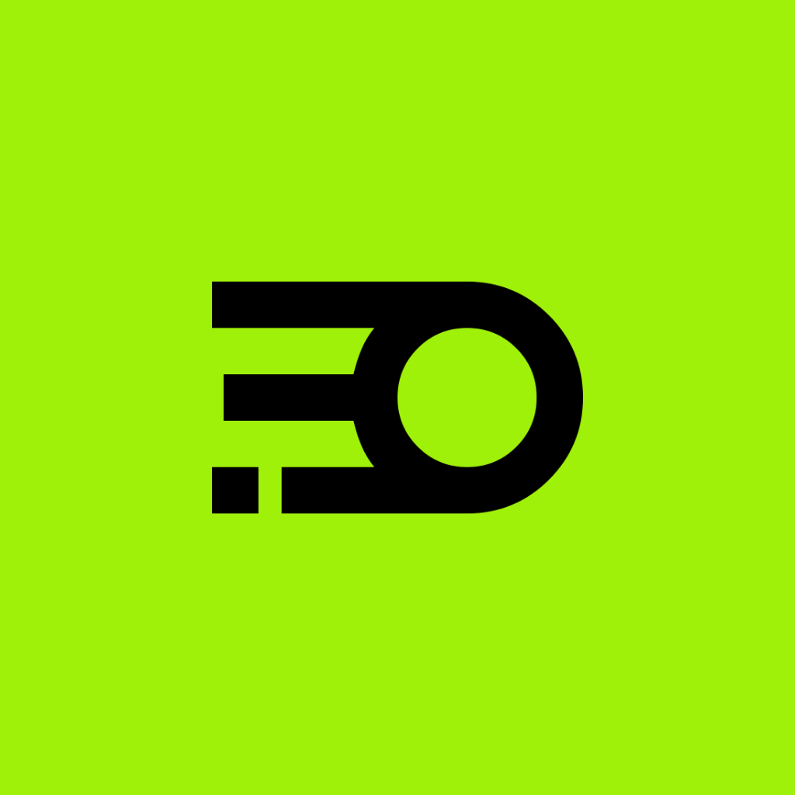

**Blur** is a clock app for iOS 26, built on **AlarmKit** — alarms and timers
that ring through the silent switch and Focus, because the system owns the alarm
rather than the app.

Three tabs, in order: **Alarms → Timer → Stopwatch**.

Its one unusual idea: you set a timer by writing a sentence. "25 min for the
pasta, chime" starts a 25-minute timer called *Pasta* that rings with *Chime* —
parsed on-device, with no network and no microphone permission.

## Requirements

| | |
|---|---|
| Xcode | 26.x |
| Deployment target | iOS 26.1 |
| Device | A real one. AlarmKit does not meaningfully run in the Simulator — alarms will not ring. |
| Optional | Apple Intelligence, for the natural-language timer field. Everything degrades without it. |

## Build

The Xcode project is generated, not committed. [XcodeGen](https://github.com/yonaskolb/XcodeGen) builds it from `project.yml`.

First, create your local signing config — generation fails without it, on purpose:

```bash
cp Config/Local.example.xcconfig Config/Local.xcconfig
```

Set `BUNDLE_ID_PREFIX` in that file to a reverse-DNS prefix you control; the
targets append their own suffix, giving `<prefix>.blur` and
`<prefix>.blur.widget`. `Config/Local.xcconfig` is gitignored, which is the
point: it holds the values that identify your Apple developer account, so they
never reach a public `project.yml`. Then:

```bash
xcodegen generate && open Blur.xcodeproj
```

Confirm your team under *Signing & Capabilities* for both targets before the
first run. Regenerate after adding or removing Swift files, or after editing
`project.yml`.

> **Never edit `Info.plist` by hand.** XcodeGen rewrites it from `project.yml` on
> every generate, so changes there are silently discarded.

## Why the alarms are reliable

The app deliberately owns as little of the firing path as possible.

- **AlarmKit schedules and rings.** No background tasks, no local notifications,
  no keep-alive audio session. The alarm is registered with the system, so it
  survives the app being killed and breaks through silent mode and Focus.
- **`AlarmCenter`** is the single place that talks to `AlarmManager`. Nothing
  else imports it, so authorization and error handling live in one file.
- **`AlarmStore.reconcile()`** re-asserts, on launch and on every foreground,
  that every enabled alarm has a live AlarmKit counterpart with the same id. If
  one is missing it's rescheduled; if it can't be rescheduled the toggle is
  switched off and the row is flagged. **A toggle that is on always means the
  alarm will ring** — the UI is never allowed to look healthier than reality.
- **`armedFor`** records the concrete date an alarm was scheduled for, which is
  how reconciliation tells a one-off that already fired (leave it off) from one
  the system dropped before firing (put it back).

There is **no App Group**. Everything the lock-screen UI needs travels inside
`AlarmAttributes.metadata`, and `LiveActivityIntent` runs in the app's own
process, so no shared container is required — which keeps signing simple.

## Timers you write instead of dial

The custom timer field is one line of free text. No wheel, no stepper, no
dropdown, and no microphone permission: it uses a plain keyboard rather than a
number pad specifically so the system dictation key is in reach. Voice input is
entirely the platform's, and the app never opens an audio session.

`TimerIntentParser` reads duration, label and tone out of that line in a single
guided-generation call against Apple's on-device model (`FoundationModels`):

```swift
@Generable
struct TimerRequest {
    @Guide(description: "Total duration in minutes.", .range(0...1440))
    var minutes: Int
    @Guide(description: "Two or three words for what the timer is for.")
    var label: String
    @Guide(description: "The tone the person named.")
    var tone: ToneChoice
}
```

Guided generation constrains decoding to that shape, so the tone is always a
case that exists and the minutes always parse. There is no free-text response to
interpret and nothing to regex afterwards.

**The model is never a hard dependency.** It's absent on ineligible hardware,
with Apple Intelligence switched off, and while assets are still downloading —
and it can refuse or fail mid-call. Every one of those paths falls through to
two model-free tiers:

| Tier | Handles | Runs when |
|---|---|---|
| `FoundationModels` | duration, label, tone, read as intent | available and the phrase isn't a bare duration |
| `PhraseHeuristics` | label and tone by stripping duration words and filler | model unavailable, failed, or returned nothing |
| `MinutesParser` | "25", "twenty five minutes", "an hour and a half" | always — it's the floor everything stands on |

A bare duration skips the model entirely, so the ordinary case stays instant.
The line under the field always says which tier answered, because a feature that
quietly does less than it claims is worse than one that says so.

## Design

Light mode only, by intent — every colour is a fixed literal rather than an
adaptive asset, so the widget extension renders from exactly the same palette as
the app.

- **Accents** are pink `#FF1C82`, lime `#A0F109`, and yellow `#FFC90D`, cycled by
  row so a grid reads as bands rather than a checkerboard.
- **Two contrast rules** govern all three, in `Theme.swift`. `onAccent` picks
  type sitting *on* an accent fill; `onCanvas` picks an accent used *as* type on
  the light page. Lime and yellow are light colours — white on them lands at
  1.4:1 and 1.6:1 — so both collapse to ink and stay fills only.
- **The gradient runs pink → yellow → lime.** Pink and lime are near-opposites;
  interpolating straight between them passes through olive sludge, so yellow
  bridges them.
- **Type is Futura**, the geometric sans Century Gothic was drawn from. It ships
  with the system, and its digits are uniform width in both cuts, so countdowns
  don't jitter.

## Layout

```
Shared/              compiled into both the app and the widget extension
  Theme.swift              palette, type, contrast rules, card + button styles
  AlarmTone.swift          tone enum → AlertConfiguration.AlertSound
  BlurAlarmMetadata.swift  payload AlarmKit hands to the Live Activity
  AlarmIntents.swift       stop / pause / resume LiveActivityIntents

Blur/
  Models/     AlarmEntry (+ Weekday, AlarmSection), TimerEntry, TimerPreset
  Services/   AlarmCenter, AlarmStore, TimerStore, StopwatchModel,
              TimerIntentParser, MinutesParser (+ PhraseHeuristics)
  Views/      RootView, Alarms/, Timers/, Stopwatch/, Components/
  Resources/  Sounds/*.caf, Assets.xcassets

BlurWidget/          Live Activity + Dynamic Island presentation
Tools/               tone generator
Config/              Local.example.xcconfig (copy to Local.xcconfig, gitignored)
blur-icon.png        1024² master for the app icon
```

The widget bundle holds a Live Activity and no home-screen widget, so it isn't
independently launchable — `Blur` is the only runnable scheme. It builds and
embeds as a dependency of the app.

## Behaviour notes

**Alarms** are filed into sections automatically from how often they repeat, so
there's nothing extra to set:

| Section | Rule |
|---|---|
| Daily | repeats all 7 days |
| Frequent | repeats on 2–6 days |
| Other | one-off, or a single weekday |

**Timers** have no history and no recents — nothing about a timer is written to
disk, and it's gone the moment it's stopped. Quick presets are 1–5, 10, 15, 20,
25, 30 min, 1 hr, 90 min, 2 hr.

**Stopwatch** is start / stop / reset only, no laps. Elapsed time is derived from
wall-clock dates rather than accumulated ticks, so it stays exact across
backgrounding and dropped timer fires.

**"No Tone"** rings a genuinely silent audio file. AlarmKit has no silent option,
so silence is the only way to get one; the alarm still displays and vibrates.

## Regenerating assets

The tone generator is stdlib-only Python, run through [uv](https://github.com/astral-sh/uv):

```bash
uv run --no-project Tools/make_tones.py
```

Then convert to the CAF files the app ships:

```bash
for f in Tools/build/*.wav; do n=$(basename "$f" .wav); afconvert -f caff -d ima4 "$f" "Blur/Resources/Sounds/$n.caf"; done
```

Each tone is a short pattern repeated to an exact multiple of its period, so a
long-ringing alarm loops without a seam.

The app icon is not generated — `blur-icon.png` is the master. iOS icons must
carry no alpha channel, so flatten it on the way into the asset catalogue:

```bash
uv run --no-project --with pillow python -c "from PIL import Image; im = Image.open('blur-icon.png'); out = Image.new('RGB', im.size, (255,255,255)); out.paste(im, mask=im.getchannel('A') if im.mode == 'RGBA' else None); out.save('Blur/Resources/Assets.xcassets/AppIcon.appiconset/icon-1024.png')"
```

## License

MIT — see [LICENSE](LICENSE).
