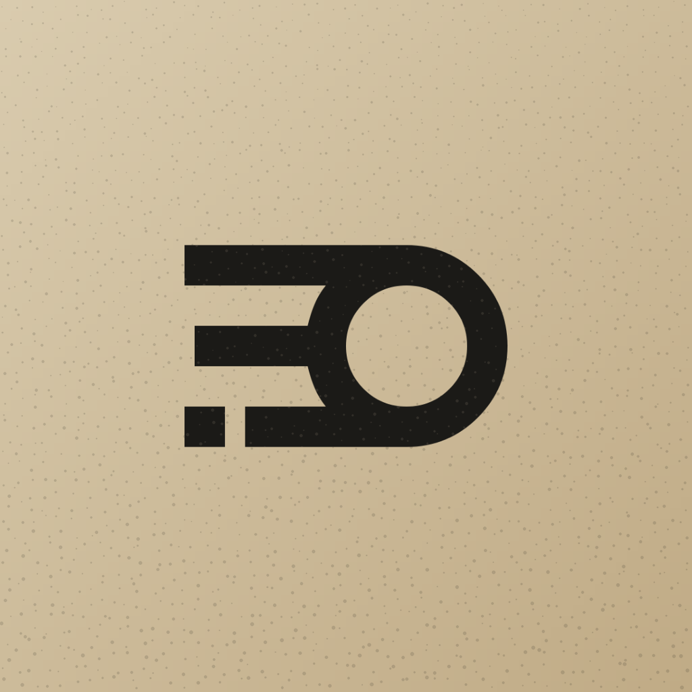

**Blur** is a clock app for iOS 26, built on **AlarmKit** — alarms and timers
that ring through the silent switch and Focus, because the system owns the alarm
rather than the app.

Three tabs, in order: **Alarms → Timer → Stopwatch**.

## Requirements

| | |
|---|---|
| Xcode | 26.x |
| Deployment target | iOS 26.1 |
| Device | A real one for anything that rings. The UI runs in the Simulator, but AlarmKit alarms and timers don't ring there. |

## Build

The Xcode project is generated, not committed. [XcodeGen](https://github.com/yonaskolb/XcodeGen) builds it from `project.yml`.

First, create your local signing-secrets file — generation fails without it, on
purpose:

```bash
cp Config/Secrets.example.xcconfig Config/Secrets.xcconfig
```

Set `DEVELOPMENT_TEAM` in that file if Xcode cannot choose your signed-in team
automatically. `Config/Secrets.xcconfig` is gitignored so the account identifier
never reaches the public repository. The bundle identifiers are fixed to
`com.izaro.blur` for the app and `com.izaro.blur.widget` for the widget. Then:

```bash
xcodegen generate && open Blur.xcodeproj
```

Confirm your team under *Signing & Capabilities* for both targets before the
first run. Regenerate after adding or removing Swift files, or after editing
`project.yml`.

> **Never edit `Info.plist` by hand.** XcodeGen rewrites it from `project.yml` on
> every generate, so changes there are silently discarded.

## Why the alarms are reliable

The app deliberately owns as little of the firing path as possible.

- **AlarmKit schedules and rings.** No background tasks, no local notifications,
  no keep-alive audio session. The alarm is registered with the system, so it
  survives the app being killed and breaks through silent mode and Focus.
- **`AlarmCenter`** is the app's single gateway to `AlarmManager`, so
  authorization, scheduling and error handling live in one file. The one
  exception is the Live Activity's stop / pause / resume intents, which call
  `AlarmManager` directly; the stores pick up the change on their next
  reconcile.
- **`AlarmStore.reconcile()`** re-asserts, on launch and on every foreground,
  that every enabled alarm has a live AlarmKit counterpart with the same id. If
  one is missing it's rescheduled; if it can't be rescheduled the row is flagged
  as unreliable and retried on the next reconcile, rather than silently
  switched off. **The UI is never allowed to look healthier than reality.**
- **`armedFor`** records the concrete date an alarm was scheduled for, which is
  how reconciliation tells a one-off that already fired (leave it off) from one
  the system dropped before firing (put it back).

There is **no App Group**. Everything the lock-screen UI needs travels inside
`AlarmAttributes.metadata`, and `LiveActivityIntent` runs in the app's own
process, so no shared container is required — which keeps signing simple.

## Fast keypad entry

Alarm creation uses a large `HH : MM` number-pad entry instead of a wheel. It
follows the device's clock preference, adding AM/PM controls only for 12-hour
locales. Timer creation uses the same visual treatment with direct
`HH : MM : SS` entry. Two valid digits advance to the next field, and the
keyboard toolbar also provides Next and Done controls.

In the alarm editor, tone chips are audible previews as well as selectors.
Bundled tones play a three-second sample on tap; Default represents AlarmKit's
system sound, and No Tone is silent.

## Design

Light mode only, by intent — every colour is a fixed literal rather than an
adaptive asset, so the widget extension renders from exactly the same palette as
the app.

- **The page is sand** `#E7DFCF`, washed cool at the top and warm at the bottom
  by four colour fields — deep sand, pale denim, lilac, tan — blurred past having
  an edge. A stipple pass over the top, dots on a jittered grid rather than
  scattered at random (which clumps and reads as dirt), gives it a tooth.
- **Cards come in three surfaces**: ivory `#FBF7EF`, charcoal `#23211E`, and
  frosted sand. Mixing light and dark cards on one screen is the main move, so
  it's a `BlurSurface` value rather than a background colour per call site — the
  surface resolves its own ink, hairlines, wells, and accent tints. Dark is
  reserved for the focal objects — scheduled alarms, running timers, the
  longest quick-timer presets, and the countdown on the lock screen.
- **Every accent is a pair** — a light form that lives on charcoal and a dark
  form of the same hue that lives on ivory — because no single mid-tone reads
  against both a near-black card and a near-white one. Denim `#A9C2E8`/`#2B5AA0`,
  lilac `#B9AEDC`/`#5B4B93`, tan `#CDBB9A`/`#7D6844`. A call site names the hue
  once; `onCharcoal` picks the light form, `onCanvas` picks the dark one, and
  `onAccent` picks the type that sits *on* an accent fill. Periwinkle `#6B7FCC`
  is the one exception — it clears 3:1 on ivory *and* 4.2:1 on charcoal, so it's
  what graphical marks use when they can't be swapped per surface.
- **Gold is not in the rotation.** It's the loudest colour here, and a colour
  that loud stops meaning anything once it's also the default button, the
  default glyph, and every third card. It's kept for the two places that should
  shout: a warning, and a timer that's finished ringing.
- Nothing user-facing sits below 4.5:1.
- **Type is Avenir Next.** The geometric sans the reference asks for, but drawn
  with a tall x-height and open apertures, so a 12pt label still reads where a
  true geometric closes up — and six weights against Futura's two, so hierarchy
  comes from weight rather than size alone. Clocks ask the face for its
  monospaced figures at the descriptor, since `.monospacedDigit()` is a no-op on
  custom fonts and proportional digits make a countdown jitter.

## Layout

```
Shared/              compiled into both the app and the widget extension
  Theme.swift              palette, type, contrast rules, card + button styles
  AlarmTone.swift          tone enum → AlertConfiguration.AlertSound
  BlurAlarmMetadata.swift  payload AlarmKit hands to the Live Activity
  AlarmIntents.swift       stop / pause / resume LiveActivityIntents

Blur/
  Models/     AlarmEntry (+ Weekday, AlarmSortOrder), TimerEntry, TimerPreset
  Services/   AlarmCenter, AlarmStore, TimerStore, StopwatchModel
  Views/      RootView, Alarms/, Timers/, Stopwatch/, Components/
  Resources/  Sounds/*.caf, Assets.xcassets

BlurWidget/          Live Activity + Dynamic Island presentation
Tools/               tone and icon generators
Config/              Secrets.example.xcconfig (copy to Secrets.xcconfig, gitignored)
blur-icon.png        1024² app icon master (generated by Tools/make_icon.py)
```

The widget bundle holds a Live Activity and no home-screen widget, so it isn't
independently launchable — `Blur` is the only runnable scheme. It builds and
embeds as a dependency of the app.

## Behaviour notes

**Alarms** build a persisted usage history from distinct occasions when
AlarmKit reports that they are actually alerting. Snooze re-alerts do not count
twice. The counter displays through 99 and then as `99+`; after 5 rings the
alarm appears in **Frequent**. Frequent alarms sort by usage count by default,
with a user-selectable chronological sort. Enabled alarms below the threshold
stay visible in **Scheduled** so they can still be edited or turned off, while
inactive alarms below 5 rings remain remembered but hidden. Creating an alarm
at an already remembered clock time revives that record and preserves its
counter.

**Timers** have no history and no recents. Only timers that are still running
are persisted, so the app can pick them back up after a relaunch; a timer is
forgotten the moment it's stopped or dismissed. Quick presets are 1–5, 10, 15,
20, 25, 30, 45, 60, 90 and 120 min, all labelled in minutes. Custom durations
use direct hours/minutes/seconds keypad entry. Timers ring with the default
tone and carry no label.

**Stopwatch** is start / stop / reset only, no laps, and shows nothing but the
elapsed time and its state. Elapsed time is derived from wall-clock dates rather
than accumulated ticks, so it stays exact across backgrounding and dropped
timer fires, and it survives a relaunch.

**"No Tone"** rings a genuinely silent audio file. AlarmKit has no silent option,
so silence is the only way to get one; the alarm still displays and vibrates.

## Regenerating assets

The tone generator is stdlib-only Python, run through [uv](https://github.com/astral-sh/uv):

```bash
uv run --no-project Tools/make_tones.py
```

Then convert to the CAF files the app ships:

```bash
for f in Tools/build/*.wav; do n=$(basename "$f" .wav); afconvert -f caff -d ima4 "$f" "Blur/Resources/Sounds/$n.caf"; done
```

Each tone is a short pattern repeated to an exact multiple of its period, so a
long-ringing alarm loops without a seam.

The app icon is generated too. The mark, `Tools/icon-glyph.png`, is the only
hand-drawn asset; the field, gradient and stipple are drawn by the script:

```bash
uv run --no-project --with pillow python Tools/make_icon.py
```

It writes `blur-icon.png` (the RGBA master shown above) and the flattened
`icon-1024.png` the asset catalogue ships, since iOS icons must carry no alpha
channel.

## License

MIT — see [LICENSE](LICENSE).
